[](https://travis-ci.org/techragesh/springboot-travis-codacy)
[](https://codecov.io/gh/techragesh/springboot-travis-codacy)
[](https://www.codacy.com/app/techragesh/springboot-travis-codacy?utm_source=github.com&amp;utm_medium=referral&amp;utm_content=techragesh/springboot-travis-codacy&amp;utm_campaign=Badge_Grade)

# springboot-travis-codacy
This repository explains how to integratie **travis**, **codecov** and **codacy** in the github application.

### Application Summary
This is a simple TicketApp application which has bascially a **CRUD** operations using **Swagger**.
I have written unit tests for this application and used **jacoco** for code coverage.

### TravisCI

>Travis CI is a hosted, distributed continuous integration service used to build and test software projects hosted at GitHub. Open source projects may be tested at no charge via travis-ci.org. Private projects may be tested at travis-ci.com on a fee basis. -wikipedia

### Codecov

>Develop healthier code using Codecov's leading, dedicated code coverage solution.

### Codacy

>Automatically identify issues through static code analysis. Get notified on security issues, code coverage, code duplication and code complexity in every commit and pull request.
>Automatically identify new issues early in the process and prevent your product from being affected. Keep your technical debt under control and focus your development time on what matters.


**Prerequisites**
* To start using Travis CI, make sure you have: A GitHub account.
* Owner permissions for a project hosted on GitHub.

### Application Screenshots

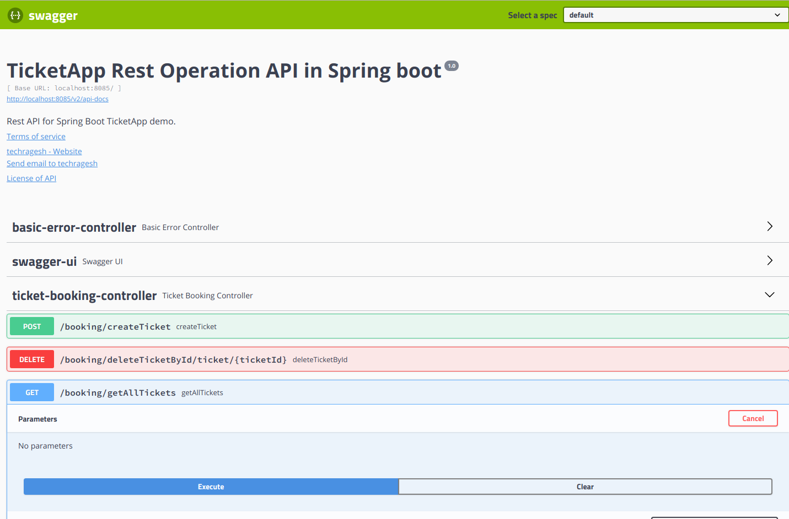

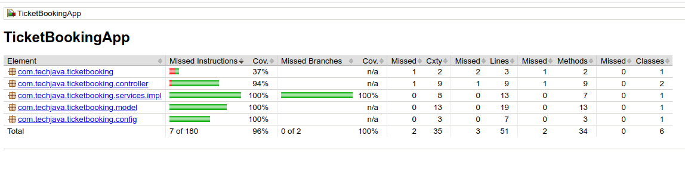

_### Steps to add **_travis-ci_** into this application_

* Create .travis.yml file for CI integration. It will call always when you commit the code.

```
language: java
jdk: oraclejdk8

sudo: required

notifications:
  email:
    recipients:
      - techragesh@gmail.com
    on_success: never
    on_failure: always

after_success:
  - bash <(curl -s https://codecov.io/bash)

```
* Login to travis-ci.org with your Github or Bitbucket Account.

* Activate your repository

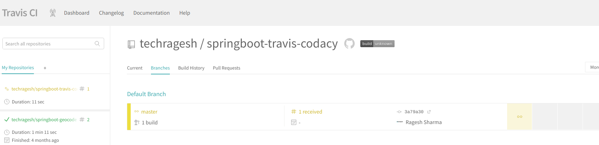

* Whenever you commit the code, the build will be called automatically. You can customize too.

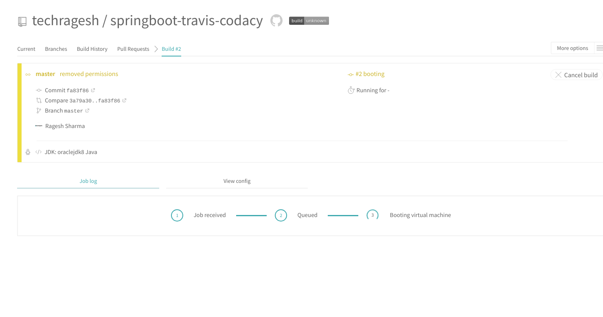

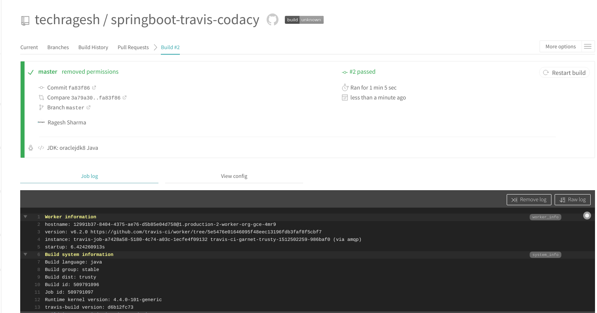

* Add the travis-ci build status icon in your readme file like this

```
[](https://travis-ci.org/techragesh/springboot-travis-codacy)

```

### _Steps to add **_codecov_** into this application_

* Login to https://codecov.io/gh with your Github or Bitbucket Account.

* Add your repository (here it is springboot-travisci-codacy)

* See the application coverage reports.

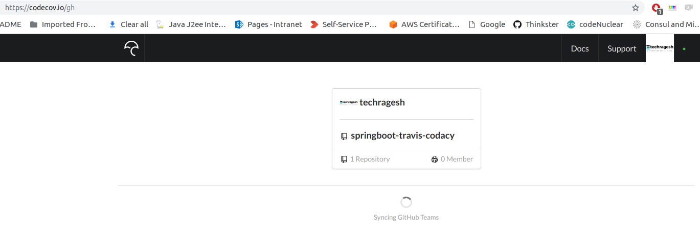

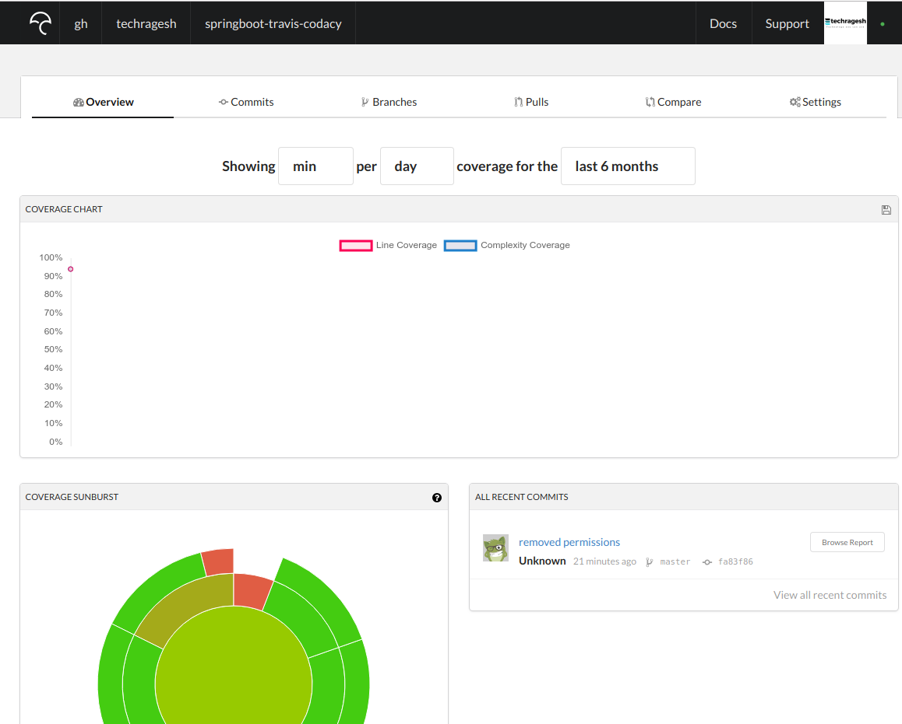

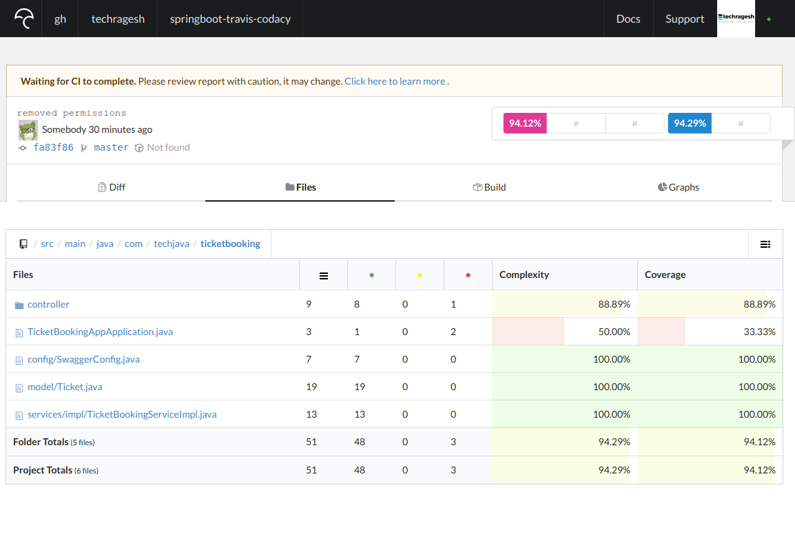

* Add the codecov status icon in your readme file like this

```
[](https://codecov.io/gh/techragesh/springboot-travis-codacy)

```

### _Steps to add **_codacy_** into this application_

* Login to codacy.com with your Github or Bitbucket Account

* Add your repository (here it is springboot-travisci-codacy)

* See the application overall reports.

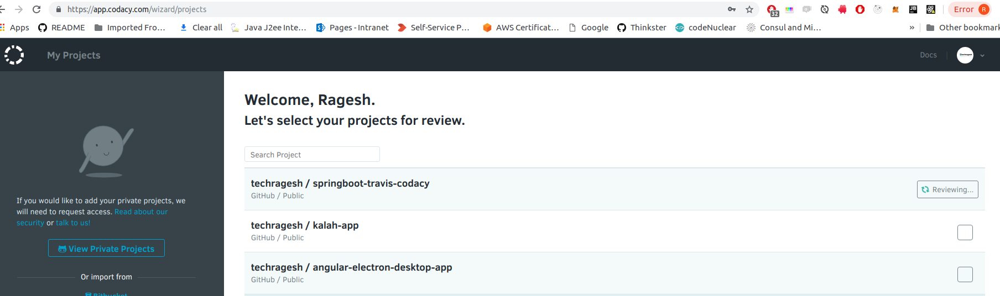

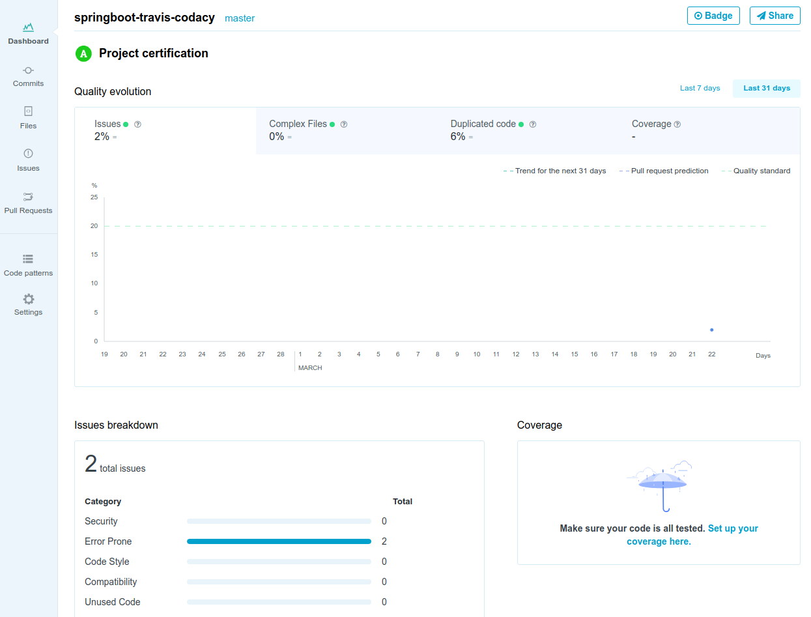

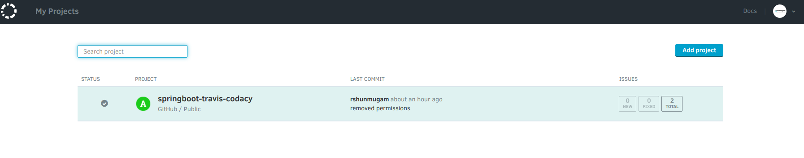

* Add the codacy status icon in your readme file like this

```
[](https://www.codacy.com/app/techragesh/springboot-travis-codacy?utm_source=github.com&amp;utm_medium=referral&amp;utm_content=techragesh/springboot-travis-codacy&amp;utm_campaign=Badge_Grade)

```

### _Application Overall Status_

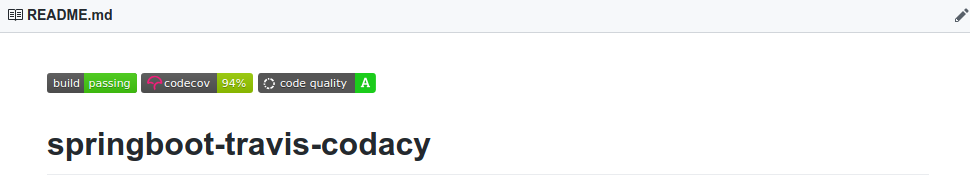

### Happy Coding